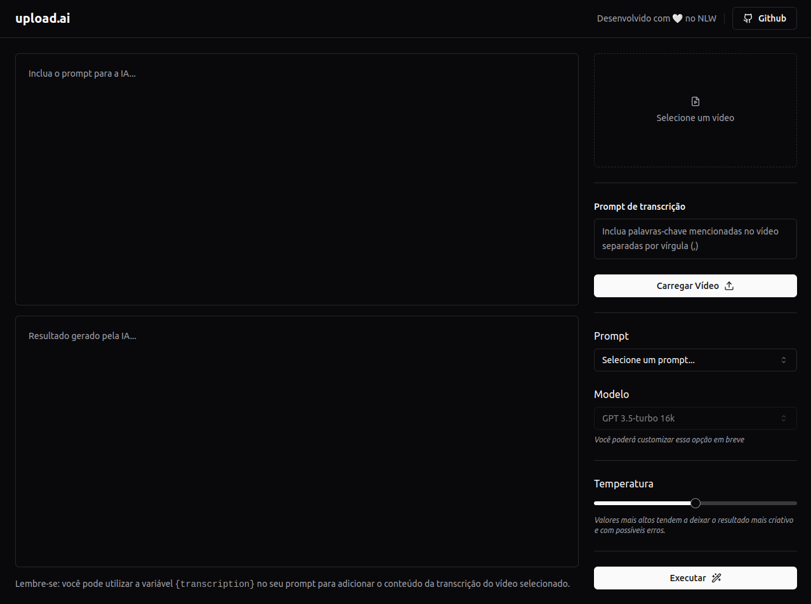

# Habits - NLW 2023 (Ignite)

  
  
  

 

> The "Upload.ai" Project was developed during the last edition of the NLW (Next Level Week) of 2023. It was done the backend and web frontend during the immersive week, in which the objective of the project was to use Artificial Intelligence in the translation of videos.

  

## 🧪 Technologies

This project was developed using the following technologies:

- [NodeJS](https://nodejs.org/)
- [Fastify](https://www.fastify.io/)
- [Prisma](https://www.prisma.io/)
- [ViteJS](https://vitejs.dev/)
- [ReactJS](https://reactjs.org/)
- [ShadCn](https://ui.shadcn.com/)
- [TailWind CSS](https://tailwindcss.com/)
- [Open AI](https://openai.com/)